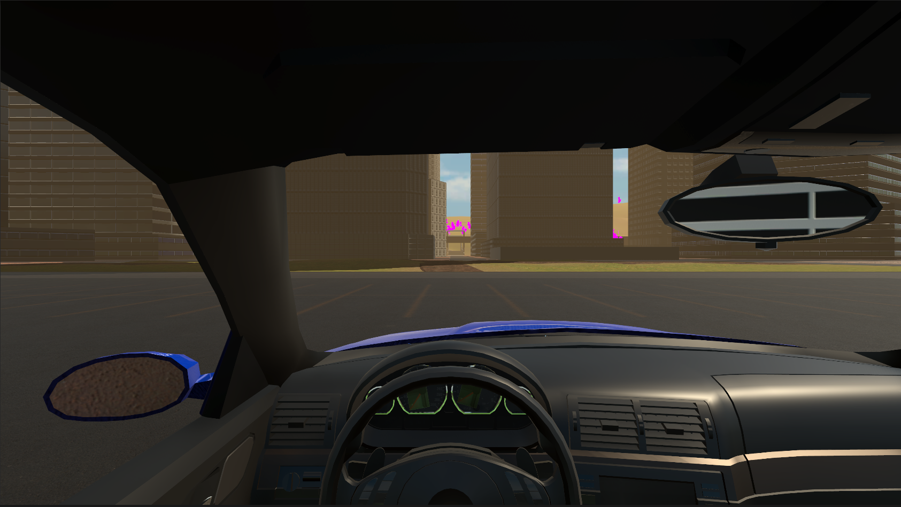
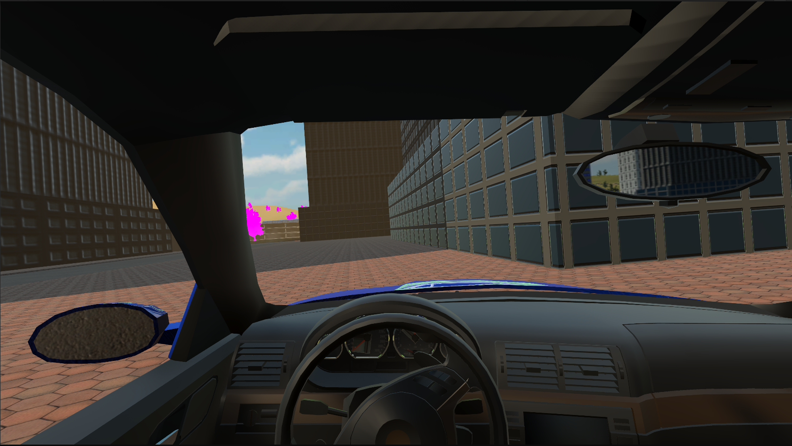
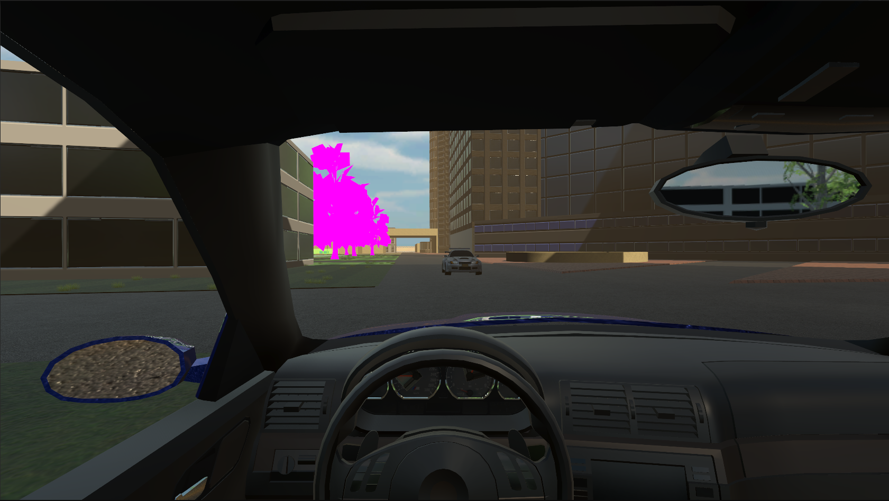
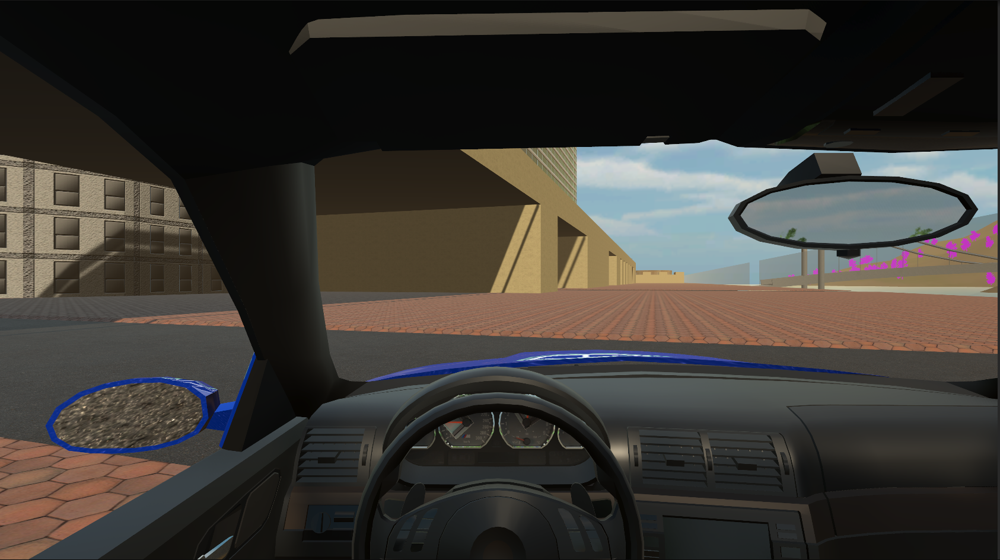

# Поездка на автомобиле

Рус | [Eng](resources/localization_readme/README_EN.md)

## Описание игры

Игра представляет собой симулятор поездки на автомобиле. Где игрок отыгрывает роль водителя. В игре присутствует система повреждений автомобиля, которая влияет на его работоспособность, также в игре присутствует система топлива, которая влияет на работоспособность автомобиля.

Игра поддерживает VR.

Управление автомобилем осуществляется с помощью двух способов:

1. С помощью клавиатуры:
    * W - газ;
    * S - тормоз;
    * A и D - повороты влево и вправо;
    * Space - ручной тормоз;
    * Shift - повышение передачи;
    * Ctrl - понижение передачи;
    * Num 0 - нейтральная передача;
    * Num 6 - задний ход;
    * Num 1-5 - соответствующая передача.
2. С помощью руля и педеалей Logitech G29 + H-shifter:
    * Руль - повороты влево и вправо;
    * Педаль газа - газ;
    * Педаль тормоза - тормоз;
    * Педаль сцепления - сцепление;
    * Ручной тормоз - ручной тормоз;
    * Коробка передач - соответствующая передача.

## Технологии

* **Движок:** Unity
* **Язык программирования:** C#
* **Система контроля версий:** Git

## Платформа

* Windows

## Лицензия

``` text
MIT License
```

## Скриншоты

### Геймплей








