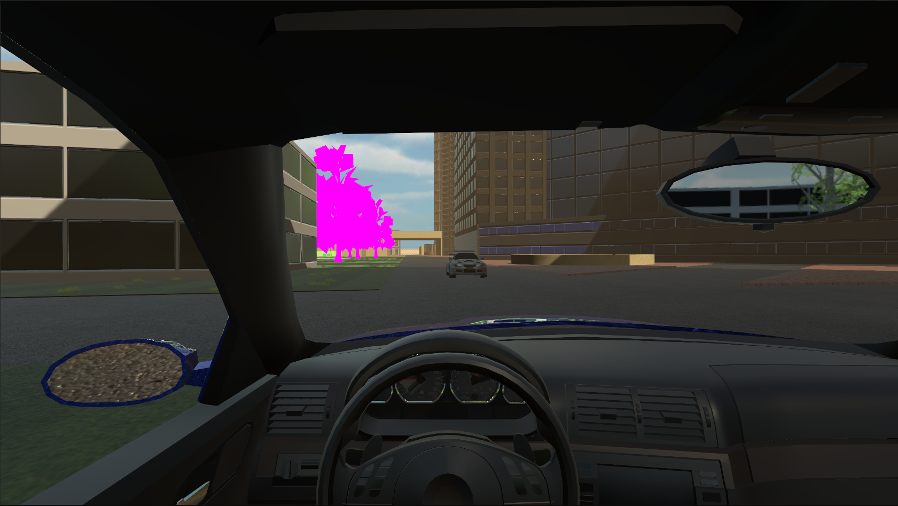

# Car Trip

## Game Description

The game is a car driving simulator where the player takes on the role of the driver. The game features a car damage system that affects its performance, as well as a fuel system that influences the car's functionality.

The game supports VR.

Car control can be done in two ways:

1. **Keyboard Controls:**
   - W: Accelerate
   - S: Brake
   - A and D: Steer left and right
   - Space: Handbrake
   - Shift: Shift up
   - Ctrl: Shift down
   - Num 0: Neutral gear
   - Num 6: Reverse
   - Num 1-5: Corresponding gears

2. **Logitech G29 + H-shifter Controls:**
   - Steering wheel: Turn left and right
   - Gas pedal: Accelerate
   - Brake pedal: Brake
   - Clutch pedal: Clutch
   - Handbrake: Handbrake
   - Gear shifter: Corresponding gears

## Technologies

- **Engine:** Unity
- **Programming Language:** C#
- **Version Control System:** Git

## Platform

- Windows

## License

```text
MIT License
```

## Screenshots

### Gameplay





